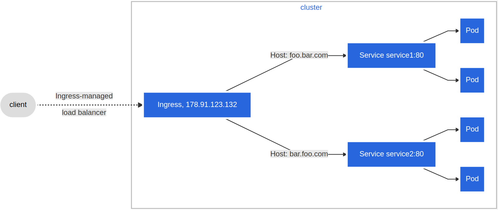

# Chapter 14: Ingress

## Tasks
- [x] None

## Introduction

In an earlier chapter, we saw how we can access our deployed containerized application from the external world via *Services*. Among the *ServiceTypes* the NodePort and LoadBalancer are the most often used. For the LoadBalancer *ServiceType*, we need to have support from the underlying infrastructure. Even after having the support, we may not want to use it for every Service, as LoadBalancer resources are limited and they can increase costs significantly. Managing the NodePort *ServiceType* can also be tricky at times, as we need to keep updating our proxy settings and keep track of the assigned ports.

In this chapter, we will explore the [Ingress](https://kubernetes.io/docs/concepts/services-networking/ingress) API resource, which represents another layer of abstraction, deployed in front of the *Service* API resources, offering a unified method of managing access to our applications from the external world.

## Ingress

With Services, routing rules are associated with a given Service. They exist for as long as the Service exists, and there are many rules because there are many Services in the cluster. If we can somehow decouple the routing rules from the application and centralize the rules management, we can then update our application without worrying about its external access. This can be done using the **Ingress** resource.

According to [kubernetes.io](https://kubernetes.io/docs/concepts/services-networking/ingress),

>An Ingress is a collection of rules that allow inbound connections to reach the cluster Services.

To allow the inbound connection to reach the cluster Services, Ingress configures a Layer 7 HTTP/HTTPS load balancer for Services and provides the following:
* TLS (Transport Layer Security)
* Name-based virtual hosting
* Fanout routing
* Loadbalancing
* Custom rules


With Ingress, users do not connect directly to a Service. Users reach the Ingress endpoint, and, from there, the request is forwarded to the desired Service. You can see an example of a sample Ingress definition below:

```yaml
apiVersion: networking.k8s.io/v1
kind: Ingress
metadata:
  name: virtual-host-ingress
  namespace: default
spec:
  rules:
  - host: blue.example.com
    http:
      paths:
      - backend:
          service:
            name: webserver-blue-svc
            port:
              number: 80
        path: /
        pathType: ImplementationSpecific
  - host: green.example.com
    http:
      paths:
      - backend:
          service:
            name: webserver-green-svc
            port:
              number: 80
        path: /
        pathType: ImplementationSpecific
```

In the example above, user requests to both **blue.example.com** and **green.example.com** would go to the same Ingress endpoint, and, from there, they would be forwarded to **webserver-blue-svc**, and **webserver-green-svc**, respectively. This is an example of a **Name-Based Virtual Hosting** Ingress rule.



We can also define **Fanout** Ingress rules, when requests to **example.com/blue** and **example.com/green** would be forwarded to **webserver-blue-svc** and **webserver-green-svc**, respectively:

```yaml
apiVersion: networking.k8s.io/v1
kind: Ingress
metadata:
  name: fan-out-ingress
  namespace: default
spec:
  rules:
  - host: example.com
    http:
      paths:
      - path: /blue
        backend:
          service:
            name: webserver-blue-svc
            port:
              number: 80
        pathType: ImplementationSpecific
      - path: /green
        backend:
          service:
            name: webserver-green-svc
            port:
              number: 80
        pathType: ImplementationSpecific
```


The Ingress resource does not do any request forwarding by itself, it merely accepts the definitions of traffic routing rules. The ingress is fulfilled by an Ingress Controller, which is a reverse proxy responsible for traffic routing based on rules defined in the Ingress resource.

## Ingress Controller

An [Ingress Controller](https://kubernetes.io/docs/concepts/services-networking/ingress-controllers) is an application watching the Master Node’s API server for changes in the Ingress resources and updates the Layer 7 Load Balancer accordingly. Ingress Controllers are also know as Controllers, Ingress Proxy, Service Proxy, Reverse Proxy, etc. Kubernetes supports an array of Ingress Controllers, and, if needed, we can also build our own. [GCE L7 Load Balancer Controller](https://github.com/kubernetes/ingress-gce/blob/master/README.md) and [Nginx Ingress Controller](https://github.com/kubernetes/ingress-nginx/blob/master/README.md) are commonly used Ingress Controllers. Other controllers are [Contour](https://projectcontour.io), [HAProxy Ingress](https://haproxy-ingress.github.io), [Istio](https://istio.io/latest/docs/tasks/traffic-management/ingress), [Kong](https://konghq.com), [Traefik](https://traefik.io), etc.
